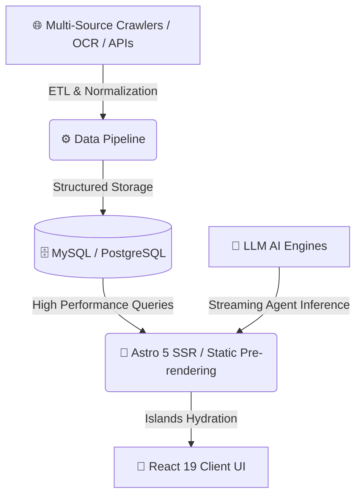

<div align="center">

```text
 ██████╗██████╗ ███████╗    ███████╗█████╗ ███╗   ██╗
 ██╔════╝██╔══██╗██╔════╝    ██╔════╝██╔══██╗████╗  ██║
 █████╗  ██║  ██║█████╗      █████╗  ███████║██╔██╗ ██║
 ██╔══╝  ██║  ██║██╔══╝      ██╔══╝  ██╔══██║██║╚██╗██║
 ██║     ██████╔╝███████╗    ██║     ██║  ██║██║ ╚████║
 ╚═╝     ╚═════╝ ╚══════╝    ╚═╝     ╚═╝  ╚═╝╚═╝  ╚═══╝
```

# FDE.FAN — Vertical AI Agent Matrix & Multi-Domain Platform

**High-Performance, Beautiful Vertical AI Agent Portal Built with Astro 5 & React 19**

[ 🇺🇸 **English** ](./README.md) • [ 🇨🇳 **中文文档** ](./README_CN.md)

---

[](https://opensource.org/licenses/MIT)
[](https://astro.build)
[](https://react.dev)
[](https://tailwindcss.com)
[](https://typescriptlang.org)
[](https://github.com/tubban1/fde.fan)

</div>

---

## 💡 What is FDE.FAN?

**FDE.FAN** is a next-generation intelligent portal aggregating multiple specialized vertical AI agents. Combining **Astro 5 Islands Architecture** with **React 19** interactive components, FDE.FAN provides automated decision-support and data analytics across business diagnosis, Gaokao admission planning, WorldCup predictions, and global AI event curation.

---

## ⚡ Key Features

<table width="100%">
<tr>
<td width="50%" valign="top">

### 🤖 1. Vertical AI Agent Matrix
* **Business Diagnosis Agent (`/diagnosis`)**: Multi-dimensional cashflow & supply chain analysis.
* **Gaokao Agent (`/gaokao`)**: Score rank matching & university admission planning.
* **WorldCup Agent (`/worldcup`)**: Real-time team roster analytics & Monte Carlo match simulation.

</td>
<td width="50%" valign="top">

### 📊 2. Data Cleaning & Parsing Pipeline
* **OCR & HTML Table Extraction**: Automated parsing of PDF/Image tables for score rankings.
* **National Data Audit**: Built-in verification scripts ensuring 100% data integrity.

</td>
</tr>
<tr>
<td width="50%" valign="top">

### 🌐 3. Global AI Event Aggregation
* **Multi-City Scraper**: Real-time crawling & normalization of tech meetups worldwide.
* **Deduplication Engine**: Automated noise reduction & event stream normalization.

</td>
<td width="50%" valign="top">

### 🎨 4. Modern Design & Extreme Performance
* **Astro 5 Islands**: Zero JS overhead for lightning-fast page loads.
* **3D & Micro-Animations**: Three.js visuals & smooth Anime.js micro-interactions.

</td>
</tr>
</table>

---

## 🛠️ Architecture & Workflow



---

## 📁 Directory Structure

```
fde.fan/
├── src/
│   ├── components/      # React 19 & Astro shared UI components
│   ├── pages/           # Routes (/diagnosis, /worldcup, /gaokao, /ai-events)
│   └── styles/          # TailwindCSS configuration & themes
├── scripts/             # Crawlers, OCR parsers, & data pipelines
├── public/              # Static assets
└── astro.config.mjs     # Astro 5 configuration
```

---

## ⚡ Quick Start

```bash
# 1. Install dependencies
npm install

# 2. Start dev server
npm run dev

# 3. Build for production
npm run build
```

---

## 🤝 License

Released under the **MIT License**.
