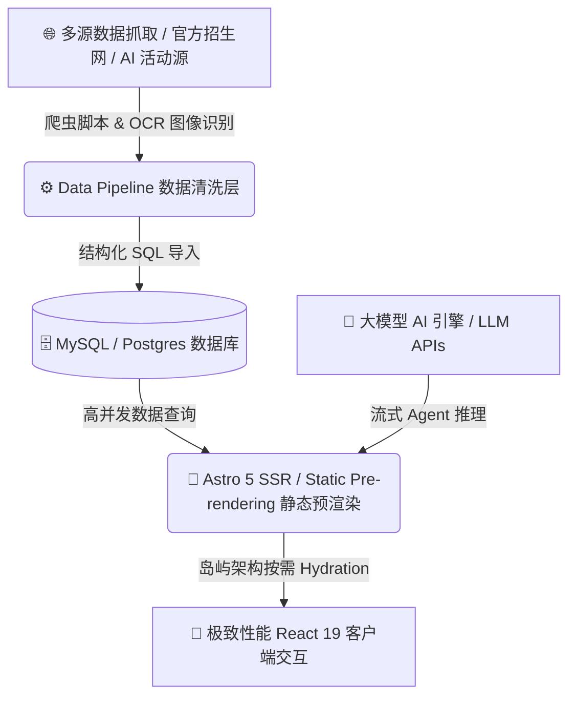

<div align="center">

```text
 ██████╗██████╗ ███████╗    ███████╗█████╗ ███╗   ██╗
 ██╔════╝██╔══██╗██╔════╝    ██╔════╝██╔══██╗████╗  ██║
 █████╗  ██║  ██║█████╗      █████╗  ███████║██╔██╗ ██║
 ██╔══╝  ██║  ██║██╔══╝      ██╔══╝  ██╔══██║██║╚██╗██║
 ██║     ██████╔╝███████╗    ██║     ██║  ██║██║ ╚████║
 ╚═╝     ╚═════╝ ╚══════╝    ╚═╝     ╚═╝  ╚═╝╚═╝  ╚═══╝
```

# FDE.FAN — 垂直领域 AI Agent 矩阵与多维能力孵化平台

**基于 Astro 5 + React 19 的高性能高颜值垂直领域 AI Agent 门户及数据处理枢纽**

[ 🇺🇸 **English** ](./README.md) • [ 🇨🇳 **中文文档** ](./README_CN.md)

---

[](https://opensource.org/licenses/MIT)
[](https://astro.build)
[](https://react.dev)
[](https://tailwindcss.com)
[](https://typescriptlang.org)
[](https://github.com/tubban1/fde.fan)

</div>

---

## 💡 什么是 FDE.FAN？

**FDE.FAN** 是一个集成了多个垂直领域 AI Agent 的下一代智能门户平台。系统结合了最新的 **Astro 5 岛屿架构 (Islands Architecture)** 与 **React 19** 交互组件，针对高考智能志愿填报、企业 AI 商业诊断、世界杯实时预测及全球 AI 线下活动提供全方位的智能决策辅助与数据分析。

> 🚀 **多 Agent 矩阵驱动**：不仅仅是一个展示网站，FDE.FAN 内置了丰富的数据抓取、OCR 图像解析、多源规则引擎与流式 AI 推理脚本，实现了从原始数据清洗到高质感前端交互的全链路打通！

---

## ⚡ 核心架构特色

<table width="100%">
<tr>
<td width="50%" valign="top">

### 🤖 1. 垂直领域 AI Agent 矩阵
* **商业诊断 Agent (`/diagnosis`)**：针对企业现金流、供应链及核心竞争力生成多维报告。
* **高考智能 Agent (`/gaokao`)**：整合全国各省一分一段表与高校招生计划进行精准志愿推演。
* **世界杯预测 Agent (`/worldcup`)**：结合历史战绩、实时阵容与蒙特卡洛模拟算法预测比赛走向。

</td>
<td width="50%" valign="top">

### 📊 2. 自动化数据清洗与解析引擎
* **多源 OCR/HTML 数据抓取**：自动解析高考成绩 PDF、一分一段表表格及 OCR 图片数据。
* **全国招生数据审计**：内置自动化规则审计脚本 (`audit-national-coverage.mjs`) 确保数据零死角。

</td>
</tr>
<tr>
<td width="50%" valign="top">

### 🌐 3. 全球 AI 线下活动实时聚合
* **多城市全网爬虫**：实时抓取并归一化全球主流城市的 AI 研讨会与开发者活动。
* **数据清洗与去重**：自动过滤无效垃圾活动，保持优质活动流无缝更新。

</td>
<td width="50%" valign="top">

### 🎨 4. 极致现代视觉与极致渲染性能
* **Astro 5 岛屿架构**：零冗余 JS 负载，实现首屏毫秒级极致加载。
* **Three.js 与 Dynamic Animation**：结合 Three.js 3D 视觉元素与 Anime.js 微交互提升用户体验。

</td>
</tr>
</table>

---

## 🛠️ 架构与 Workflow 流程图



---

## 🛠️ 固化标准化生产工具链 (CLI Tools)

| 工具脚本 | 命令 | 功能描述 |
| :--- | :--- | :--- |
| **开发服务启动** | `npm run dev` | 启动 Astro 5 本地热加载开发服务器 |
| **高考数据爬虫** | `npm run gaokao:crawl` | 自动抓取各省招考办官方权威公布数据 |
| **一分一段表解析** | `npm run gaokao:parse-score-rank` | HTML/Spreadsheet/OCR 自动解析分段表 |
| **世界杯数据同步** | `npm run worldcup:sync` | 定时同步最新球队阵容与历史比赛数据 |
| **AI 活动流抓取** | `npm run ai-events:crawl-all` | 全量运行全球 AI 线下活动爬虫与标准化清洗 |
| **商业诊断演示测试** | `npm run diagnosis:test-agent-demo` | 验证商业诊断 Agent 安全策略与生成逻辑 |

---

## 📁 目录结构

```
fde.fan/
├── src/
│   ├── components/      # 高颜值的 React 19 与 Astro 共享交互组件
│   ├── pages/           # 页面路由 (包含 /diagnosis, /worldcup, /gaokao, /ai-events)
│   └── styles/          # TailwindCSS 样式系统与主题 Token
├── scripts/
│   ├── gaokao/          # 高考高考数据抓取、OCR 解析与清洗工具集
│   ├── ai-events/       # AI 活动自动化抓取与归一化 Pipeline
│   ├── worldcup/        # 世界杯数据同步 Daemon
│   └── diagnosis/       # 商业诊断 Agent 自动化验证工具
├── public/              # 静态资源与矢量图标库
├── astro.config.mjs     # Astro 5 极速引擎与 Vercel 适配器配置
└── package.json         # 项目依赖与自动化脚本规范
```

---

## ⚡ 快速开始

### 1. 配置环境变量
复制 `.env.example` 并填入相关数据库与 AI API 密钥：

```bash
cp .env.example .env.local
```

### 2. 安装依赖并启动开发服务器

```bash
# 安装 pnpm 或 npm 依赖
npm install

# 启动开发服务器
npm run dev
```

### 3. 构建生产包

```bash
npm run build
```

---

## 🤝 开源协议 (License)

本项目基于 **MIT License** 开源。

<div align="center">
  <sub>FDE 工程团队精心打造。基于 Astro 5, React 19, TailwindCSS 与 TypeScript 构建。</sub>
</div>
